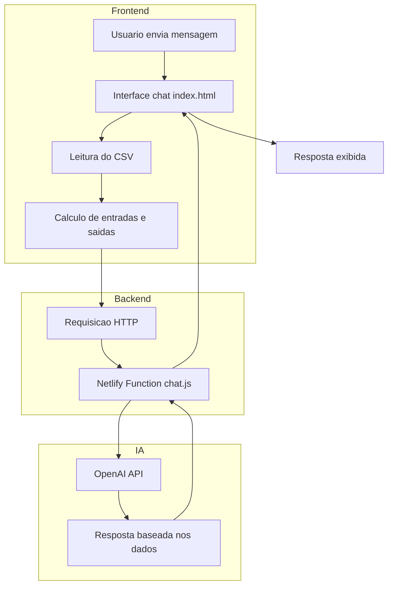

# 🐷 Porquinho — Agente Financeiro Inteligente com IA

🔗 **Acesse a aplicação:**  
https://estudoagentevirtualia.netlify.app/

---

## 📌 Sobre o Projeto

O **Porquinho** é um assistente financeiro inteligente desenvolvido como desafio final do bootcamp **Accenture + DIO — Python para Análise e Automação de Dados**.

A proposta foi criar um agente que vai além de um chatbot tradicional, utilizando **IA Generativa (OpenAI 4o mini)** para:

- Interpretar dados financeiros do usuário
- Gerar respostas contextualizadas
- Oferecer insights e orientação financeira
- Simular um atendimento consultivo


ps: se o site não abrir, atingi meu número de créditos mensais do netflify

---

## 🎯 Caso de Uso

O agente resolve o problema de:

👉 **Falta de clareza sobre gastos e organização financeira pessoal**

Com isso, ele permite ao usuário:

- Visualizar saldo (entradas vs saídas)
- Entender padrões de gastos
- Receber sugestões financeiras
- Interagir de forma simples via chat

---

## 🧠 Persona e Tom de Voz

**Nome:** Porquinho 🐷  
**Estilo:** Amigável, leve e acolhedor  
**Tom:** Conversacional e educativo  

O agente foi projetado para:
- Evitar linguagem técnica excessiva
- Incentivar boas práticas financeiras
- Criar uma experiência próxima de um “consultor pessoal”

---

## 🏗️ Arquitetura da Solução

A aplicação segue uma arquitetura simples, porém eficiente:

### 🔹 Frontend
- Interface em HTML, CSS e JavaScript
- Chat interativo
- Leitura de dados CSV local

### 🔹 Backend (Serverless)
- Função serverless (`/functions/chat.js`)
- Integração com API da OpenAI (modelo 4o mini)

### 🔹 Dados
- Arquivo CSV com histórico financeiro:
  - `historico_financeiro.csv`

---

## 🔄 Fluxo da Aplicação (Arquitetura)



---

## 🔐 Segurança e Confiabilidade

Para evitar respostas incorretas ou “alucinações”:

- Uso de **dados estruturados (CSV)** como base de contexto
- Envio de informações reais do usuário junto ao prompt
- Restrição do escopo para finanças pessoais
- Respostas baseadas em dados fornecidos

---

## 📊 Base de Conhecimento

O agente utiliza:

- 📄 `historico_financeiro.csv`

Campos:
- `data`
- `tipo` (Entrada / Saída)
- `categoria`
- `descricao`
- `valor`

Esses dados são processados para gerar:
- Total de entradas
- Total de saídas
- Saldo atual

---

## 💬 Prompts do Agente

### System Prompt (resumo)

O agente é instruído a:

- Atuar como assistente financeiro pessoal
- Usar os dados fornecidos (saldo, entradas, saídas)
- Ser claro, objetivo e útil
- Evitar inventar informações

### Exemplo de Interação

**Usuário:**
> Ver meu saldo

**Agente:**
> Você teve R$ X de entradas e R$ Y de saídas. Seu saldo atual é R$ Z.

---

## ⚙️ Tecnologias Utilizadas

- HTML5 / CSS3 / JavaScript
- Netlify (deploy e serverless functions)
- OpenAI API (modelo 4o mini)
- GitHub (versionamento)

---

## 📁 Estrutura do Projeto

```
📁 projeto/
│
├── index.html                  # Interface do chatbot
├── historico_financeiro.csv   # Base de dados financeira
│
├── 📁 functions/
│   └── chat.js               # Função serverless (IA)
│
└── README.md
```

---

## 📈 Métricas e Avaliação

O agente pode ser avaliado com base em:

- ✔️ Precisão das respostas financeiras
- ✔️ Coerência com os dados do CSV
- ✔️ Clareza na comunicação
- ✔️ Experiência do usuário (UX)

---

## 🚀 Diferenciais

- Interface moderna e responsiva
- Simulação de consultoria financeira real
- Integração com IA generativa
- Processamento de dados local (leve e rápido)
- Deploy serverless (baixo custo)

---

## 🎤 Pitch (Resumo)

O Porquinho é um assistente financeiro inteligente que transforma dados simples em insights úteis.

Ele combina:
- IA generativa
- análise de dados
- experiência conversacional

Para ajudar pessoas a:
👉 entender melhor seu dinheiro  
👉 tomar decisões mais conscientes  
👉 criar hábitos financeiros saudáveis  

---

## 📌 Próximos Passos

- Upload de CSV pelo usuário
- Gráficos interativos (gastos por categoria)
- Metas financeiras automatizadas
- Recomendações personalizadas mais avançadas
- Integração com banco de dados real

---

## 👩‍💻 Autora

Projeto desenvolvido por **Fernanda Brandão**  
Bootcamp Accenture + DIO — 2026 🚀
